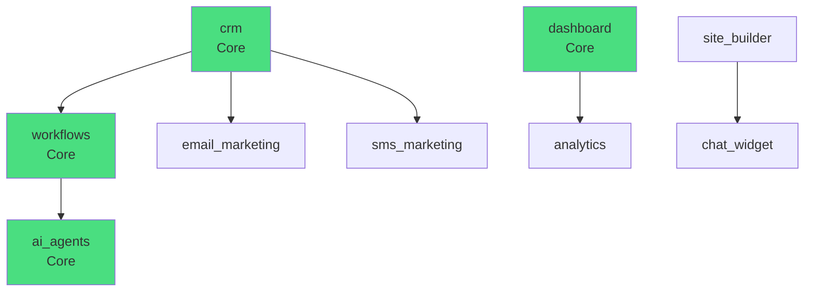

# FlowStack Multi-Agent Build - Orchestration Center

**Document Version**: 1.0
**Last Updated**: 2026-01-26
**Orchestrator Agent**: Infrastructure Coordination

## Executive Summary

FlowStack is a React 19 SPA with Supabase backend implementing a modular AI-native business platform. This document serves as the central coordination hub for all specialized agents working on different aspects of the platform.

---

## Current Architecture State

### Tech Stack
- **Frontend**: React 19, TypeScript 5.9 (strict), Vite 7
- **Routing**: React Router DOM v7 with lazy-loaded routes
- **State**: Zustand (client), TanStack React Query v5 (server)
- **UI**: Tailwind CSS v4, Radix UI, shadcn/ui, Lucide icons
- **Drag & Drop**: @dnd-kit (builder), @xyflow/react (workflows)
- **Backend**: Supabase (PostgreSQL + Auth + Edge Functions)
- **Path Alias**: `@/` maps to `./src/`

### Project Structure
```
E:\FlowStack/
├── .orchestrator/          # This coordination center
├── db/                     # Database schemas
│   ├── init.sql           # Core: user_profiles, orgs, memberships
│   ├── crm_schema.sql     # contacts, companies
│   ├── deals_schema.sql   # pipelines, stages, deals
│   ├── workflow_schema.sql # workflows, workflow_executions
│   ├── builder_schema.sql  # sites, funnels, pages
│   ├── marketing_schema.sql # templates, campaigns, logs
│   └── agents_schema.sql   # agent_executions, orchestrator_tasks
├── src/
│   ├── components/        # Shared UI components
│   ├── context/          # React contexts (Auth, Feature, Agent)
│   ├── features/         # Feature modules (self-contained)
│   ├── lib/              # Utilities, registry, supabase client
│   └── types/            # TypeScript type definitions
└── supabase/             # Supabase functions
```

---

## Agent Assignment Matrix

### Infrastructure Agents (A1-A4)

| Agent ID | Agent Name | Primary Focus | File Ownership | Dependencies |
|----------|-------------|---------------|----------------|--------------|
| **A1** | Database Schema Agent | All SQL schemas | `db/*.sql` | None |
| **A2** | TypeScript Types Agent | Type definitions | `src/types/**` | A1 |
| **A3** | Workflow Engine Agent | Workflow execution | `src/lib/workflows/**` | A1, A2 |
| **A4** | AI Integration Agent | Claude API integration | `src/lib/ai/**`, Edge Functions | A2, A3 |

### Foundation & UI Agents (A11-A12)

| Agent ID | Agent Name | Primary Focus | File Ownership | Dependencies |
|----------|-------------|---------------|----------------|--------------|
| **A11** | Foundation Agent | Critical error fixes | `package.json`, `tsconfig.json`, `src/features/analytics/dashboards/types.ts` | None |
| **A12** | UI/UX Agent | Linear-style design system | `src/index.css`, `src/components/ui/**`, `src/components/layout/**` | A11 |

**Skills Used by A12**:
- `frontend-design:frontend-design` - Production-grade UI design
- `vercel-react-best-practices` - React optimization patterns
- `web-design-guidelines` - UI compliance review

### Feature Agents (A5-A10)

| Agent ID | Agent Name | Feature Module | Directory | Dependencies |
|----------|-------------|----------------|-----------|--------------|
| **A5** | Dashboard Agent | Dashboard module | `src/features/dashboard/**` | A2, A12 |
| **A6** | CRM Agent | Core CRM module | `src/features/crm/**` | A1, A2, A12 |
| **A7** | Builder Agent | Site & Funnel Builder | `src/features/builder/**` | A2, A12 |
| **A8** | Workflows Agent | Workflow Automation | `src/features/workflows/**` | A2, A3, A12 |
| **A9** | Marketing Agent | Email/SMS Marketing | `src/features/marketing/**` | A1, A2, A12 |
| **A10** | Analytics Agent | Analytics & Reporting | `src/features/analytics/**` | A2, A12 |

---

## Module Dependency Graph

### Core Modules (Cannot be Disabled)
- `dashboard` - Command center
- `crm` - Contact management
- `workflows` - Automation engine
- `ai_agents` - Multi-agent system

### Dependency Map



### Build Order Recommendation

**Phase 1 (Infrastructure)**: A1 → A2 → A3 → A4
**Phase 2 (Core Features)**: A5 → A6
**Phase 3 (Automation)**: A8 → A10
**Phase 4 (Extended Features)**: A7 → A9 → A11 (Chat) → A12 (Deals)

---

## Integration Contract Between Agents

### Rule 1: Types Must Precede Implementation
- **A2 (Types Agent)** must complete `src/types/database.types.ts` before any feature agent implements CRUD operations
- All agents must import types from `@/types` only - no inline type definitions

### Rule 2: Database Schema Lock
- **A1 (Schema Agent)** owns all schema files
- Feature agents requesting schema changes must submit PRs to A1
- Breaking schema changes require version bump and migration script

### Rule 3: Workflow Engine Integration
- **A3 (Workflow Agent)** provides standard workflow execution interface
- Feature agents must register workflow actions via:
  ```typescript
  // src/lib/workflows/registry.ts
  registerAction('contact.created', {
    handler: async (context) => { ... },
    schema: { ... }
  });
  ```

### Rule 4: AI Function Registration
- **A4 (AI Agent)** provides function registry
- Feature agents register available AI functions:
  ```typescript
  // src/lib/ai/functions/registry.ts
  registerAIFunction({
    name: 'crm.search_contacts',
    description: 'Search contacts by name, email, or company',
    parameters: { ... },
    handler: async (params) => { ... }
  });
  ```

---

## Data Model Summary

### Complete Database Tables (7 schemas, 23 tables)

#### Core (init.sql)
- `user_profiles` - User profile data
- `organizations` - Multi-tenant organizations
- `memberships` - User-org relationships with roles

#### CRM (crm_schema.sql)
- `companies` - Company/organization accounts
- `contacts` - Individual contacts

#### Deals (deals_schema.sql)
- `pipelines` - Custom pipelines (sales, hiring, etc.)
- `stages` - Pipeline stages (Kanban columns)
- `deals` - Opportunities with value and status

#### Workflows (workflow_schema.sql)
- `workflows` - Workflow definitions with triggers, nodes, edges
- `workflow_executions` - Execution history with logs

#### Builder (builder_schema.sql)
- `sites` - Websites with subdomain/custom domain
- `funnels` - Funnel definitions with steps
- `pages` - Individual pages with content JSONB

#### Marketing (marketing_schema.sql)
- `marketing_templates` - Email/SMS templates
- `marketing_campaigns` - Campaign management
- `marketing_logs` - Individual message delivery logs

#### Agents (agents_schema.sql)
- `agent_executions` - Agent execution tracking
- `orchestrator_tasks` - Orchestrator workflow executions
- `agent_capabilities` - Agent capability cache

**Total**: 23 tables across 7 schemas

---

## Type Registry Status

### Current State
- `src/types/database.types.ts` exists but is **INCOMPLETE**
- Only covers: `organizations`, `user_profiles`, `memberships`, `companies`, `contacts`
- Missing types for: deals, workflows, builder, marketing, agents tables

### Required Type Updates (A2 Priority)

**Missing Tables**:
- `pipelines`, `stages`, `deals`
- `workflows`, `workflow_executions`
- `sites`, `funnels`, `pages`
- `marketing_templates`, `marketing_campaigns`, `marketing_logs`
- `agent_executions`, `orchestrator_tasks`, `agent_capabilities`

**Type Generation Priority**:
1. High: workflows, agent_executions (AI agents depend on these)
2. Medium: marketing tables, builder tables
3. Low: deals tables (feature agent not yet active)

---

## Feature Gap Analysis

### Dashboard (`src/features/dashboard/`)
**Status**: Basic scaffold
**Existing**: `DashboardPage.tsx`, basic widget structure
**Missing**:
- Widget library (stats, charts, activity feeds)
- Customizable dashboard layout
- Real-time data refresh
- Integration with other modules

### CRM (`src/features/crm/`)
**Status**: Partially implemented
**Existing**: `ContactList.tsx`, `CompanyList.tsx`, `CrmLayout.tsx`
**Implemented**:
- Contact list view with search
- Company list view
- Basic CRUD UI
**Missing**:
- Contact detail view
- Company detail view
- Activity timeline
- Advanced filtering
- Bulk operations
- Import/export
- Deals pipeline integration

### Builder (`src/features/builder/`)
**Status**: Scaffold with Zustand store
**Existing**: `BuilderPage.tsx`, `useBuilderStore.ts`, block definitions
**Implemented**:
- Basic block editor structure
- Zustand store with undo/redo
- Block definitions
**Missing**:
- Full drag-and-drop canvas
- Block property editors
- Page publishing flow
- Preview mode
- Version history
- Funnel step linking

### Workflows (`src/features/workflows/`)
**Status**: Visual builder scaffold
**Existing**: `WorkflowBuilder.tsx` (XyFlow), `WorkflowListPage.tsx`
**Implemented**:
- XyFlow canvas
- Node/edge types
- Workflow list
**Missing**:
- Node configuration panels
- Trigger configuration
- Workflow execution engine (A3)
- Testing/debugging mode
- Execution history view
- Workflow templates

### Marketing (`src/features/marketing/`)
**Status**: Basic campaign management
**Existing**: `CampaignList.tsx`, `CampaignBuilder.tsx`, `TemplateEditor.tsx`
**Implemented**:
- Campaign list and builder
- Template editor
- Basic email/SMS types
**Missing**:
- Rich template editor
- Campaign scheduling
- Audience builder
- Delivery tracking
- A/B testing
- Automation triggers

### Analytics (`src/features/analytics/`)
**Status**: NOT IMPLEMENTED
**Missing**: Entire module

---

## Development Workflow

### Agent Coordination Protocol

1. **Agent Onboarding**
   - Read this `coordination.md` document
   - Check `dependencies.md` for prerequisite work
   - Review relevant sections of `data-model.md`
   - Claim tasks in this document

2. **Work Execution**
   - Create feature branches from `develop`
   - Follow file ownership matrix
   - Use shared type contracts
   - Test integration points

3. **Integration Checkpoints**
   - See `integration-checkpoints.md` for phase-end verification
   - All agents must sign off before phase completion
   - Run integration tests
   - Update coordination docs

4. **Handoff Protocol**
   - Update relevant sections of `coordination.md`
   - Document breaking changes
   - Update `data-model.md` if schema changed
   - Notify dependent agents

---

## Ralph Loop Validation

### Overview

The Ralph Loop is a two-layer validation pattern that ensures all agent work is error-free before marking tasks complete. All agents (A1-A10) must pass Ralph Loop validation before their work is considered complete.

### Architecture

```
┌─────────────────────────────────────────────────────────────────┐
│              OUTER RALPH LOOP (Checkpoint Level)               │
│                                                                  │
│  Phase Checkpoint → Validate All Agents → Sign-off             │
│  (max 5 retries, comprehensive validation)                     │
└─────────────────────────────────────────────────────────────────┘
                                  │
                                  ▼
┌─────────────────────────────────────────────────────────────────┐
│              INNER RALPH LOOPS (Per-Agent)                     │
│                                                                  │
│  A1 ───► validate_schema() ───► code_reviewer                  │
│  A2 ───► validate_types() ───► code_reviewer                   │
│  A3 ───► validate_engine() ───► code_reviewer                  │
│  ...                                                            │
└─────────────────────────────────────────────────────────────────┘
```

### Configuration

- **Max Retries**: 5 validation attempts
- **Validation Agent**: Code Reviewer Agent (A0)
- **Retry Delay**: 1000ms between attempts
- **On Failure**: Retry with feedback

### Per-Agent Workflow

1. Agent completes task
2. Agent runs inner Ralph loop (self-validation)
3. Agent marks work as "ready for review"
4. Code reviewer validates (outer loop)
5. If validation passes → mark complete
6. If validation fails → retry with feedback (max 5)

### Checkpoint Workflow

1. All agents in phase complete their work
2. Orchestrator runs checkpoint Ralph loop
3. Validate: code quality, documentation, integration
4. Run integration tests
5. Verify performance benchmarks
6. If all pass → phase sign-off
7. If any fail → retry with feedback

### Validation Coverage

**Code Quality**:
- Syntax validation (no errors)
- Linting (ESLint passes)
- TypeScript compilation
- SQL syntax validation
- JSON/YAML structure

**Documentation**:
- MD files updated
- Checklists completed
- API documentation complete
- Code comments present

**Integration**:
- Types match schemas
- Module contracts satisfied
- RLS policies defined
- API endpoints match

### Running Validation

**Per-Agent Validation**:
```bash
./.orchestrator/scripts/validate-agent.sh A1
./.orchestrator/scripts/validate-agent.sh A2
```

**Checkpoint Validation**:
```bash
./.orchestrator/scripts/validate-checkpoint.sh 0 "A1 A2 A3 A4"
./.orchestrator/scripts/validate-checkpoint.sh 1 "A5 A6 A10"
```

### References

- [Ralph Loop Configuration](./ralph-loop.md) - Full configuration and rules
- [Code Reviewer Agent](./agents/CodeReviewerAgent.md) - Validation agent spec
- [Integration Checkpoints](./integration-checkpoints.md) - Phase verification

---

## Communication Protocol

### Daily Standup (Async)
- Each agent updates status in shared doc
- Blockers highlighted in red
- Dependencies requested in advance

### Integration Meetings
- Called when phases complete
- All dependent agents participate
- Demo integration points
- Resolve conflicts

### Documentation Updates
- All agents keep docs current
- Update `coordination.md` when ownership changes
- Document new patterns in relevant docs

---

## Next Steps for Each Agent

### Immediate Actions (Week 1)

**A1 (Schema Agent)**:
- Review all 7 schema files for consistency
- Add missing indexes
- Document RLS policies
- Create migration script

**A2 (Types Agent)**:
- Generate missing TypeScript types for all 23 tables
- Create `src/types/index.ts` for clean exports
- Add helper types for common operations

**A3 (Workflow Agent)**:
- Design workflow execution engine architecture
- Define action registration interface
- Plan integration with Supabase Edge Functions

**A4 (AI Agent)**:
- Set up Claude API client infrastructure
- Design function registry system
- Plan agent-to-agent communication protocol

**A5-A10 (Feature Agents)**:
- Wait for A2 to complete types
- Review current scaffolding
- Plan implementation roadmap
- Document dependencies on A3/A4

---

## Risk Mitigation

### High-Risk Dependencies
1. **A2 blocks all feature agents** - Types must be complete first
2. **A3 blocks A8 (Workflows)** - No workflow execution without engine
3. **A4 blocks AI features** - No AI integration without client

### Mitigation Strategy
- A2 and A3 are highest priority
- Feature agents can work on UI scaffolding while waiting
- Parallel work on non-dependent features

---

## Version History

| Version | Date | Changes | Agent |
|---------|------|---------|-------|
| 1.0 | 2026-01-26 | Initial orchestration setup | Orchestrator |

---

**Document Maintainer**: Orchestrator Agent
**Last Review**: 2026-01-26
**Next Review**: After Phase 1 completion
