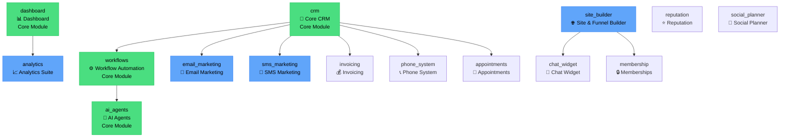

# FlowStack Module Dependencies

**Document Version**: 1.0
**Last Updated**: 2026-01-26
**Maintainer**: Orchestrator Agent

## Module Dependency Graph

### Overview

FlowStack uses a modular architecture where features can be enabled/disabled per organization. This document defines the dependency relationships between all modules and provides build order recommendations.

---

## Module Registry

### Core Modules (Cannot be Disabled)

| Module ID | Name | Category | Status | Dependencies |
|-----------|------|----------|--------|--------------|
| `dashboard` | Dashboard | Analytics | Scaffold | None |
| `crm` | Core CRM | CRM | Partial | None |
| `workflows` | Workflow Automation | Automation | Scaffold | `crm` |
| `ai_agents` | AI Agents | AI | Planned | `workflows` |

### Extended Modules (Can be Disabled)

| Module ID | Name | Category | Status | Dependencies |
|-----------|------|----------|--------|--------------|
| `site_builder` | Site & Funnel Builder | Builder | Scaffold | None |
| `email_marketing` | Email Marketing | Marketing | Partial | `crm` |
| `sms_marketing` | SMS Marketing | Marketing | Partial | `crm` |
| `analytics` | Analytics Suite | Analytics | Planned | None |
| `chat_widget` | Chat Widget | AI | Planned | `site_builder` |
| `invoicing` | Invoicing | CRM | Placeholder | `crm` |
| `reputation` | Reputation Management | Marketing | Placeholder | None |
| `social_planner` | Social Planner | Marketing | Placeholder | None |
| `membership` | Memberships | Builder | Placeholder | `site_builder` |
| `phone_system` | Phone System | CRM | Placeholder | `crm` |
| `appointments` | Appointments | CRM | Placeholder | `crm` |

---

## Visual Dependency Graph

### Mermaid Diagram



---

## Dependency Analysis

### Direct Dependencies

#### `workflows` depends on:
- **`crm`**: Workflows need to access contacts/companies for automation triggers

#### `ai_agents` depends on:
- **`workflows`**: AI agents execute within workflow context

#### `email_marketing` depends on:
- **`crm`**: Email campaigns target contacts from CRM

#### `sms_marketing` depends on:
- **`crm`**: SMS campaigns target contacts from CRM

#### `chat_widget` depends on:
- **`site_builder`**: Chat widget embedded on built pages

#### `membership` depends on:
- **`site_builder`**: Membership sites use page builder

#### `invoicing` depends on:
- **`crm`**: Invoices sent to contacts/companies

#### `phone_system` depends on:
- **`crm`**: Call tracking linked to contacts

#### `appointments` depends on:
- **`crm`**: Appointments booked with contacts

---

## Transitive Dependencies

### `ai_agents` Transitive Chain
```
ai_agents
  → workflows
    → crm
```

### `email_marketing` / `sms_marketing` Chain
```
email_marketing / sms_marketing
  → crm
```

### `chat_widget` Chain
```
chat_widget
  → site_builder
```

### `membership` Chain
```
membership
  → site_builder
```

---

## Build Order Recommendation

### Phase 1: Foundation (Priority: CRITICAL)

**Order**: 1 → 2 → 3 → 4

1. **`dashboard`** (No dependencies)
   - Agent: A5 (Dashboard Agent)
   - Effort: 2 weeks
   - Deliverables: Widget library, dashboard layout, real-time updates

2. **`crm`** (No dependencies)
   - Agent: A6 (CRM Agent)
   - Effort: 3 weeks
   - Deliverables: Complete CRUD, list views, detail views, search/filter

3. **`analytics`** (No dependencies)
   - Agent: A10 (Analytics Agent)
   - Effort: 2 weeks
   - Deliverables: Reporting engine, chart library, data aggregation

4. **`site_builder`** (No dependencies)
   - Agent: A7 (Builder Agent)
   - Effort: 4 weeks
   - Deliverables: Drag-drop canvas, block library, publishing

**Checkpoint**: Phase 1 complete when dashboard, CRM, analytics, and builder are functional

---

### Phase 2: Automation (Priority: HIGH)

**Order**: 1 → 2

1. **`workflows`** (Depends on: `crm`)
   - Agent: A8 (Workflows Agent)
   - Effort: 4 weeks
   - Deliverables: Visual workflow builder, execution engine, trigger system

2. **`ai_agents`** (Depends on: `workflows`)
   - Agent: A4 (AI Integration Agent)
   - Effort: 3 weeks
   - Deliverables: AI function registry, agent execution system

**Checkpoint**: Phase 2 complete when workflows can automate CRM operations

---

### Phase 3: Marketing (Priority: MEDIUM)

**Order**: 1 → 2 → 3 (can work in parallel after CRM complete)

1. **`email_marketing`** (Depends on: `crm`)
   - Agent: A9 (Marketing Agent)
   - Effort: 2 weeks
   - Deliverables: Email campaigns, templates, delivery tracking

2. **`sms_marketing`** (Depends on: `crm`)
   - Agent: A9 (Marketing Agent)
   - Effort: 1 week
   - Deliverables: SMS campaigns, 2-way messaging, Twilio integration

3. **`chat_widget`** (Depends on: `site_builder`)
   - Agent: A11 (Chat Agent - TBD)
   - Effort: 2 weeks
   - Deliverables: Chat widget, AI chatbot, embed code

**Checkpoint**: Phase 3 complete when marketing campaigns can be created and sent

---

### Phase 4: Extended Features (Priority: LOW)

**Order**: Any (all independent after foundation)

1. **`invoicing`** (Depends on: `crm`)
   - Effort: 2 weeks
   - Deliverables: Invoice creation, payment processing, Stripe integration

2. **`appointments`** (Depends on: `crm`)
   - Effort: 2 weeks
   - Deliverables: Calendar booking, availability management, reminders

3. **`phone_system`** (Depends on: `crm`)
   - Effort: 3 weeks
   - Deliverables: VoIP calling, call recording, tracking

4. **`membership`** (Depends on: `site_builder`)
   - Effort: 2 weeks
   - Deliverables: Gated content, course delivery, member areas

5. **`reputation`** (No dependencies)
   - Effort: 1 week
   - Deliverables: Review aggregation, review requests, ratings

6. **`social_planner`** (No dependencies)
   - Effort: 2 weeks
   - Deliverables: Social scheduling, content calendar, analytics

**Checkpoint**: Phase 4 complete when all planned modules are implemented

---

## Parallel Development Opportunities

### Can Work in Parallel (After Foundation)

**Group 1**: After `crm` is complete
- `email_marketing`
- `sms_marketing`
- `invoicing`
- `appointments`
- `phone_system`

**Group 2**: After `site_builder` is complete
- `chat_widget`
- `membership`

**Group 3**: Independent (can start anytime)
- `analytics` (recommended in Phase 1)
- `reputation`
- `social_planner`

---

## Critical Path Analysis

### Longest Dependency Chain

```
dashboard → crm → workflows → ai_agents
    2w      3w      4w        3w
    = 12 weeks (minimum)
```

**Critical Path**: 12 weeks

### Alternative Critical Path (if builder needed first)

```
dashboard → site_builder → chat_widget → membership
    2w          4w           2w            2w
    = 10 weeks
```

---

## Risk Assessment

### High-Risk Dependencies

1. **`workflows` blocked by `crm`**
   - Risk: High
   - Mitigation: Start workflows UI scaffolding while CRM completes
   - Fallback: Create mock CRM data for workflow testing

2. **`ai_agents` blocked by `workflows`**
   - Risk: High
   - Mitigation: Start AI client infrastructure before workflow engine complete
   - Fallback: Test AI agents with standalone executions

3. **`email_marketing` and `sms_marketing` blocked by `crm`**
   - Risk: Medium
   - Mitigation: Build campaign UI with mock contact data
   - Fallback: None critical

### Medium-Risk Dependencies

1. **`chat_widget` blocked by `site_builder`**
   - Risk: Medium
   - Mitigation: Build chat widget as standalone component first
   - Fallback: Provide generic embed script

2. **`membership` blocked by `site_builder`**
   - Risk: Low
   - Mitigation: None needed (can use builder in parallel)

---

## Dependency Management in Code

### FeatureGuard Component Usage

```tsx
// Example: Protecting routes that depend on other modules
<Route path="workflows" element={
  <FeatureGuard moduleId="workflows" redirectTo="/">
    {/* This checks if workflows AND crm (dependency) are enabled */}
    <WorkflowLayout />
  </FeatureGuard>
} />
```

### Module Dependency Checking

The `FeatureGuard` component should validate dependencies:

```typescript
// src/components/FeatureGuard.tsx (enhanced)
const FeatureGuard = ({ moduleId, redirectTo, children }) => {
  const { enabledModules } = useFeatures();
  const module = MODULES[moduleId];

  // Check if module is enabled
  if (!enabledModules.includes(moduleId)) {
    return <Navigate to={redirectTo} replace />;
  }

  // Check if all dependencies are enabled
  if (module.dependencies) {
    const missingDeps = module.dependencies.filter(
      dep => !enabledModules.includes(dep)
    );
    if (missingDeps.length > 0) {
      console.warn(`Module ${moduleId} requires: ${missingDeps.join(', ')}`);
      return <Navigate to={redirectTo} replace />;
    }
  }

  return <>{children}</>;
};
```

---

## Module Enable/Disable Logic

### Organization Module Settings

Database table (future enhancement):

```sql
create table public.organization_modules (
  id uuid primary key default uuid_generate_v4(),
  organization_id uuid references public.organizations(id) not null,
  module_id text not null, -- ModuleId enum
  enabled boolean not null default true,
  created_at timestamptz default now(),
  updated_at timestamptz default now(),
  unique(organization_id, module_id)
);
```

### Default Module Configuration

```typescript
// src/lib/registry.ts
export const getDefaultModules = (): ModuleId[] => [
  'dashboard',    // Always enabled
  'crm',          // Always enabled
  'workflows',    // Always enabled
  'ai_agents',    // Always enabled
  'site_builder', // Enabled by default
  'analytics',    // Enabled by default
];
```

---

## Integration Points

### CRM → Workflows Integration

**Triggers**:
- `contact.created` - When new contact added
- `contact.updated` - When contact modified
- `company.created` - When new company added
- `deal.stage_changed` - When deal moves to new stage

**Actions**:
- `crm.create_contact` - Create contact
- `crm.update_contact` - Update contact
- `crm.search_contacts` - Search contacts
- `crm.add_note` - Add activity note

### CRM → Marketing Integration

**Triggers**:
- `contact.added_to_list` - For campaign targeting
- `contact.tag_added` - For segmentation

**Actions**:
- `marketing.send_email` - Send single email
- `marketing.add_to_campaign` - Add to campaign

### Workflows → AI Agents Integration

**Agent Types**:
- `orchestrator` - Coordinates multi-agent workflows
- `crm` - CRM-focused AI agent
- `marketing` - Marketing-focused AI agent
- `analytics` - Analytics-focused AI agent
- `builder` - Builder-focused AI agent
- `workflow` - Workflow-focused AI agent

**Execution Flow**:
```
Workflow Triggered
  → Orchestrator Agent invoked
  → Determines which specialized agents to call
  → Executes agent chain
  → Returns result to workflow
  → Workflow continues
```

---

## Summary

### Key Points

1. **4 Core Modules**: dashboard, crm, workflows, ai_agents
2. **11 Extended Modules**: Can be enabled/disabled per organization
3. **Critical Path**: 12 weeks minimum (dashboard → crm → workflows → ai_agents)
4. **Parallel Opportunities**: After foundation, multiple features can be built simultaneously
5. **Risk Mitigation**: Start UI scaffolding while dependencies complete

### Build Phases

- **Phase 1** (Foundation): dashboard, crm, analytics, site_builder
- **Phase 2** (Automation): workflows, ai_agents
- **Phase 3** (Marketing): email_marketing, sms_marketing, chat_widget
- **Phase 4** (Extended): invoicing, appointments, phone_system, membership, reputation, social_planner

### Next Steps

1. Infrastructure agents (A1-A4) complete foundation
2. Dashboard and CRM agents start immediately
3. Builder and Analytics agents can work in parallel
4. Marketing agents wait for CRM foundation
5. Workflows agent waits for CRM triggers
6. AI agents wait for workflow engine

---

**Document Maintainer**: Orchestrator Agent
**Last Updated**: 2026-01-26
**Next Review**: After Phase 1 completion
